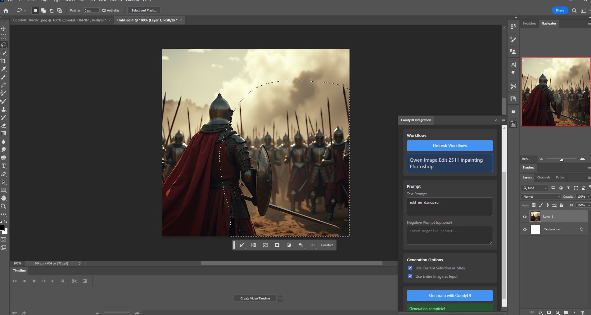
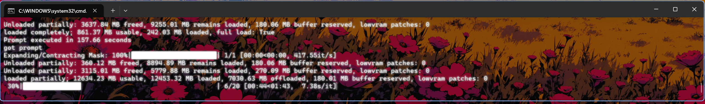
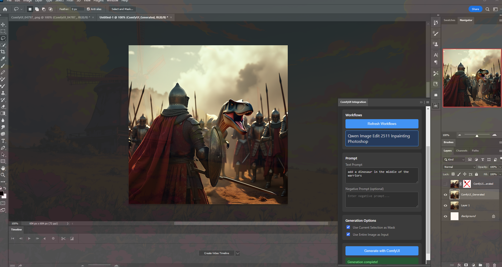

# ComfyUI Photoshop Plugin

A powerful Photoshop plugin that integrates local ComfyUI workflows directly into Photoshop, replacing Adobe's generative AI with your own customizable ComfyUI workflows.

## Features

- 🎨 **Direct Integration**: Run ComfyUI workflows directly from Photoshop
- 🔧 **Flexible Workflows**: Use any ComfyUI workflow (text2img, img2img, inpainting, etc.)
- 🖼️ **Layer Support**: Send current layer or selection to ComfyUI
- 🎭 **Mask Support**: Use Photoshop selections as inpainting masks
- 💾 **Auto-Import**: Generated images automatically import back to Photoshop
- 🌐 **Local Processing**: Everything runs on your machine with ComfyUI

## Example

Select an area in Photoshop, type a prompt, and hit Generate — the result is automatically imported as a new layer.

| Select area + write prompt |
|  | 
| ComfyUI processes the workflow |
    | 
|  Result imported into Photoshop |
         |

## Architecture

```
┌─────────────────────┐
│  Photoshop CEP      │
│  Panel (HTML/JS)    │
└──────────┬──────────┘
           │ HTTP Requests        ExtendScript (.jsx)
           ▼                      for PS operations
┌─────────────────────┐
│   ComfyUI Server    │
│   (localhost:8188)  │
└──────────┬──────────┘
           │
           ▼
┌─────────────────────┐
│  Stable Diffusion   │
│  /Custom Models     │
└─────────────────────┘
```

## Prerequisites

1. **Adobe Photoshop 2021+** (version 22.0 or later, tested on PS 2023)
2. **ComfyUI** installed and running locally

## Installation

### Step 1: Install ComfyUI

If you haven't already, install ComfyUI:

```bash
git clone https://github.com/comfyanonymous/ComfyUI.git
cd ComfyUI
pip install -r requirements.txt
```

### Step 2: Start ComfyUI Server

```bash
python main.py
```

ComfyUI should start on `http://127.0.0.1:8188`

### Step 3: Install the Photoshop Plugin

**Option A: Run the installer (recommended)**

1. Download or clone this repository
2. Double-click `install.bat` (run as Administrator for system-wide install)
3. Restart Photoshop
4. Go to **Window > Extensions > ComfyUI Integration**

> **Re-installing?** The installer preserves your `workflows/` folder — your custom workflow JSON files will not be deleted when you update the plugin.

**Option B: Manual install**

1. Enable unsigned extensions: open `regedit`, navigate to
   `HKEY_CURRENT_USER\SOFTWARE\Adobe\CSXS.11`, create a String value
   `PlayerDebugMode` set to `1`. Repeat for `CSXS.9`, `CSXS.10`, `CSXS.12`.
2. Copy this entire folder to the CEP extensions directory:
   - **System-wide:** `C:\Program Files (x86)\Common Files\Adobe\CEP\extensions\com.comfyui.photoshop\`
   - **Per-user:** `%APPDATA%\Adobe\CEP\extensions\com.comfyui.photoshop\`
3. Restart Photoshop
4. Go to **Window > Extensions > ComfyUI Integration**

## Usage

### Basic Workflow

1. **Open the Plugin Panel**
   - Go to Window → Extensions → ComfyUI Integration

2. **Test Connection**
   - Verify ComfyUI server URL (default: `http://127.0.0.1:8188`)
   - Click "Test Connection"

3. **Add Workflows**
   - In ComfyUI web UI, build your workflow and click **"Save (API Format)"**
   - Place the exported `.json` file in the plugin's `workflows/` folder
   - Click "Refresh Workflows" in the plugin to load them
   - Click on a workflow to select it

4. **Configure Your Generation**
   - Enter your text prompt
   - (Optional) Enter negative prompt
   - Choose options:
     - Use Current Selection as Mask (for inpainting)
     - Use Entire Image as Input (for img2img)

5. **Generate**
   - Click "Generate with ComfyUI"
   - Wait for processing (status will update)
   - Generated image will automatically import to Photoshop

### Workflow Types

#### Text-to-Image
- Create images from text prompts
- No input image needed
- Great for generating new content

#### Image-to-Image
- Transform existing images based on prompts
- Uses current layer as input
- Preserves composition while changing style/details

#### Inpainting
- Fill selected areas with AI-generated content
- Uses Photoshop selection as mask
- Perfect for object removal, modification, or addition

#### Outpainting
- Extend images beyond their current boundaries
- Expands canvas and fills new areas

## Creating Custom Workflows

1. Open the ComfyUI web interface (`http://127.0.0.1:8188`)
2. Build your workflow — choose your checkpoint, sampler, steps, CFG, etc.
3. Click **"Save (API Format)"** to export the workflow as a JSON file
4. Place the `.json` file in the plugin's `workflows/` folder:
   - **Before install:** `Photoshop_ComfyUI_Plugin/workflows/`
   - **After install:** `%APPDATA%\Adobe\CEP\extensions\com.comfyui.photoshop\workflows\` (shown in plugin UI)
5. In the plugin, click "Refresh Workflows" — your workflow will appear in the list

### Workflow Requirements

Your ComfyUI workflows must include:

1. **Prompt Nodes**: CLIPTextEncode nodes for positive/negative prompts
2. **Output Node**: SaveImage node to save results
3. **Proper Connections**: Valid node connections for your workflow type

The checkpoint, sampler, steps, CFG, and all other settings come directly from your exported workflow — no need to configure them in the plugin.

### Dynamic Parameter Injection

When you click Generate, the plugin automatically detects where to inject your inputs — no manual editing of the JSON required.

**Seeds** — randomized in every node that has a numeric `seed` or `noise_seed` input (KSampler, RandomNoise, custom nodes, etc.)

**Prompts** — detected in two ways (tried in order):
1. **Connection tracing**: Finds any node with both `positive` and `negative` conditioning inputs (KSampler, etc.), then follows those connections and injects into the first matching string input (`text`, `prompt`, `caption`, `positive_prompt`, `text_positive`). Works with CLIPTextEncode, TextEncodeQwenImageEditPlus, and other custom encoding nodes.
2. **Input name matching** (fallback for custom nodes): Scans for inputs named `prompt`, `positive_prompt`, `text_positive`, `text`, `caption` for the positive prompt, and `negative_prompt`, `text_negative` for the negative prompt

**Images + Masks (inpainting)** — when both "Use Entire Image" and "Use Selection as Mask" are enabled:
- The image and selection are combined into a **single PNG with alpha channel** (selected area = transparent)
- ComfyUI's `LoadImage` node automatically extracts both the RGB image (output 0) and the mask from alpha (output 1)
- The raw mask is also uploaded separately for workflows using `LoadImageMask` nodes
- This works with both standard inpaint workflows and custom nodes like Qwen Image Edit

**Images only** — injected into any node whose `class_type` starts with `Load` and contains `Image` (but not `Mask`)

**Masks only** — injected into any node whose `class_type` starts with `Load` and contains `Mask`

Everything else in the workflow (checkpoint, sampler, scheduler, steps, CFG, denoise, etc.) is left exactly as you exported it.

## Advanced Configuration

### Server Settings

Edit the server URL in the plugin UI or directly in localStorage:
```javascript
localStorage.setItem("comfyui_server_url", "http://192.168.1.100:8188");
```

### Custom Models

Place your custom models in ComfyUI's model folders:
- `models/checkpoints/` - Stable Diffusion checkpoints
- `models/loras/` - LoRA models
- `models/controlnet/` - ControlNet models
- `models/vae/` - VAE models

Update your workflow JSON to reference these models.

### Workflow Parameters

You can customize generation parameters in your workflows:

```json
{
  "3": {
    "inputs": {
      "seed": 0,           // Will be randomized
      "steps": 20,         // Sampling steps
      "cfg": 8,            // CFG scale
      "sampler_name": "euler",
      "scheduler": "normal",
      "denoise": 1         // Denoising strength (0-1)
    },
    "class_type": "KSampler"
  }
}
```

## Troubleshooting

### Plugin Not Showing in Window > Extensions
- Make sure `PlayerDebugMode` registry keys are set (run `install.bat` to set them automatically)
- Verify the extension folder exists at `%APPDATA%\Adobe\CEP\extensions\com.comfyui.photoshop\`
- Restart Photoshop after installing
- Check that `CSXS\manifest.xml` is present in the installed folder

### Buttons Not Responding / Nothing Happens
- Open Chrome DevTools at `http://localhost:8088` and check the Console for errors
- If you see `require is not defined`, Node.js is not enabled — make sure `--enable-nodejs` is in `CSXS/manifest.xml` CEFCommandLine
- Re-run `install.bat` and restart Photoshop after any file changes

### Connection Failed
- Ensure ComfyUI server is running (`python main.py`)
- Check the server URL matches your ComfyUI instance
- Verify no firewall is blocking port 8188

### Generation Timeout
- Large images or complex workflows take time
- Check ComfyUI console for errors
- Reduce image size or steps in workflow

### Image Not Importing
- Check Photoshop permissions
- Verify ComfyUI output directory is accessible
- Look for errors in the plugin's status area

### Selection Mask Not Working
- Ensure you have an active selection in Photoshop
- Selection must be on the current layer
- Check "Use Current Selection as Mask" is enabled

## Development

### Project Structure

```
Photoshop_ComfyUI_Plugin/
├── CSXS/
│   └── manifest.xml           # CEP extension manifest
├── client/
│   ├── index.html             # Panel UI (HTML/CSS)
│   ├── index.js               # Panel logic (JS + Node.js)
│   └── lib/
│       └── CSInterface.js     # Adobe CEP bridge library
├── host/
│   └── index.jsx              # ExtendScript (Photoshop operations)
├── workflows/                 # Place ComfyUI API-format .json files here
├── .debug                     # Chrome DevTools debug config
├── install.bat                # One-click Windows installer
├── config.json                # Plugin configuration
├── workflow_manager.py        # Python workflow utilities
└── README.md
```

### Debugging

1. Open Chrome and navigate to `http://localhost:8088`
   (port defined in `.debug`)
2. The panel's console and DOM inspector will be available

### API Reference

#### ComfyUI HTTP Endpoints Used

- `GET /system_stats` - Check server status
- `POST /upload/image` - Upload image/mask to ComfyUI
- `POST /prompt` - Queue a generation
- `GET /history/{prompt_id}` - Check generation status
- `GET /view` - Retrieve generated images

#### ExtendScript Functions (host/index.jsx)

```javascript
// Export flattened document as PNG, returns temp file path
exportActiveDocument()

// Export active layer only as PNG, returns temp file path
exportActiveLayer()

// Export selection as B&W mask PNG, returns temp file path
exportSelectionMask()

// Import an image file as a new layer
importImageAsLayer(filePath)

// Get document dimensions/info as JSON string
getDocumentInfo()
```

## Roadmap

- [ ] Batch processing multiple layers
- [ ] ControlNet integration
- [ ] LoRA selection UI
- [ ] Model switcher in UI
- [ ] Parameter presets
- [ ] Generation history
- [ ] Progress indicators with preview
- [ ] Workflow editor in plugin
- [ ] Cloud ComfyUI support

## Contributing

Contributions welcome! Please:

1. Fork the repository
2. Create a feature branch
3. Test thoroughly in Photoshop
4. Submit a pull request

## License

MIT License - feel free to use and modify for your projects

## Credits

- Built with Adobe CEP (Common Extension Platform) and ExtendScript
- Powered by [ComfyUI](https://github.com/comfyanonymous/ComfyUI)
- Inspired by Photoshop's generative fill feature

## Support

For issues and questions:
- Check the Troubleshooting section above
- Review [ComfyUI documentation](https://github.com/comfyanonymous/ComfyUI)
- Review [Adobe CEP documentation](https://github.com/Adobe-CEP/CEP-Resources)
- Open an issue on GitHub

---

**Note**: This plugin is not affiliated with Adobe. It's a community project to integrate local AI processing with Photoshop.
